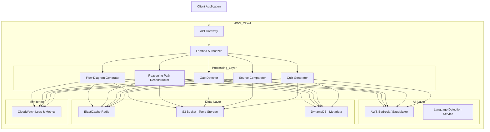

# Design Document: AI-Powered Structured Learning Assistant

## Overview

The AI-Powered Structured Learning Assistant is a serverless application built on AWS that transforms unstructured study materials into structured learning resources. The system uses AI models to analyze text, reconstruct reasoning, detect gaps, and generate educational content while maintaining strict schema enforcement, privacy protection, and responsible AI behavior.

The architecture prioritizes:
- **Low latency**: Sub-15 second response times for complex operations
- **Low bandwidth**: Compressed responses under 100KB for core functionality
- **Global scale**: Serverless auto-scaling across regions
- **Privacy**: Ephemeral processing with encryption at rest and in transit
- **Reliability**: Schema validation and structured error handling

## Architecture

### High-Level Architecture



### Component Responsibilities

**API Gateway**:
- Request routing to appropriate Lambda functions
- Rate limiting and throttling
- Request/response transformation
- CORS handling for web clients

**Lambda Functions** (one per processing type):
- `flow-diagram-generator`: Converts text to flow diagrams
- `reasoning-path-reconstructor`: Extracts logical reasoning chains
- `gap-detector`: Identifies missing conceptual steps
- `source-comparator`: Compares two documents
- `quiz-generator`: Creates multiple-choice quizzes

**AI Layer**:
- AWS Bedrock (Claude or similar) for text analysis and generation
- Custom prompts with structured output enforcement
- Language detection using AWS Comprehend or Bedrock

**Data Layer**:
- ElastiCache Redis: Response caching (TTL: 1 hour)
- S3: Temporary storage for large inputs (auto-delete after 24 hours)
- DynamoDB: Request metadata, rate limiting counters

**Monitoring**:
- CloudWatch Logs: All Lambda execution logs (PII-filtered)
- CloudWatch Metrics: Latency, error rates, cache hit rates
- X-Ray: Distributed tracing for performance analysis

### Data Flow Example: Flow Diagram Generation

1. Client sends POST request to `/api/v1/flow-diagram` with study notes
2. API Gateway validates request format and routes to Lambda
3. Lambda function:
   - Checks cache for similar request (hash-based)
   - If cache miss, detects language using AWS Comprehend
   - Constructs AI prompt with schema enforcement instructions
   - Calls AWS Bedrock with structured output mode
   - Validates response against JSON schema
   - Converts to Mermaid diagram format
   - Compresses response if > 50KB
   - Stores in cache
4. Returns structured response to client

## Components and Interfaces

### API Endpoints

#### POST /api/v1/flow-diagram
Generates a flow diagram from unstructured text.

**Request Schema**:
```json
{
  "text": "string (required, max 50000 chars)",
  "outputLanguage": "string (optional, ISO 639-1 code)",
  "format": "string (optional, 'mermaid' | 'dot', default: 'mermaid')"
}
```

**Response Schema**:
```json
{
  "diagram": "string (Mermaid or DOT syntax)",
  "concepts": [
    {
      "id": "string",
      "label": "string",
      "type": "string (concept | process | decision)"
    }
  ],
  "relationships": [
    {
      "from": "string (concept id)",
      "to": "string (concept id)",
      "type": "string (leads_to | requires | contradicts)"
    }
  ],
  "metadata": {
    "detectedLanguage": "string",
    "processingTimeMs": "number",
    "conceptCount": "number"
  }
}
```

#### POST /api/v1/reasoning-path
Reconstructs logical reasoning paths from text.

**Request Schema**:
```json
{
  "text": "string (required, max 50000 chars)",
  "outputLanguage": "string (optional)"
}
```

**Response Schema**:
```json
{
  "paths": [
    {
      "id": "string",
      "steps": [
        {
          "stepNumber": "number",
          "statement": "string",
          "type": "string (premise | inference | conclusion)",
          "confidence": "number (0-1)"
        }
      ],
      "isComplete": "boolean"
    }
  ],
  "metadata": {
    "detectedLanguage": "string",
    "processingTimeMs": "number"
  }
}
```

#### POST /api/v1/detect-gaps
Identifies logical gaps and missing concepts.

**Request Schema**:
```json
{
  "text": "string (required, max 50000 chars)",
  "outputLanguage": "string (optional)"
}
```

**Response Schema**:
```json
{
  "gaps": [
    {
      "id": "string",
      "type": "string (missing_prerequisite | logical_jump | incomplete_reasoning)",
      "location": {
        "startChar": "number",
        "endChar": "number",
        "context": "string"
      },
      "severity": "string (high | medium | low)",
      "description": "string",
      "suggestedConcepts": ["string"],
      "priority": "number (1-10)"
    }
  ],
  "summary": {
    "totalGaps": "number",
    "highSeverityCount": "number",
    "missingPrerequisites": ["string"]
  },
  "metadata": {
    "detectedLanguage": "string",
    "processingTimeMs": "number"
  }
}
```

#### POST /api/v1/compare-sources
Compares two source documents.

**Request Schema**:
```json
{
  "source1": {
    "text": "string (required, max 50000 chars)",
    "label": "string (optional, e.g., 'Official Notes')"
  },
  "source2": {
    "text": "string (required, max 50000 chars)",
    "label": "string (optional, e.g., 'My Notes')"
  },
  "outputLanguage": "string (optional)"
}
```

**Response Schema**:
```json
{
  "comparison": {
    "missingInSource2": [
      {
        "concept": "string",
        "importance": "string (high | medium | low)",
        "context": "string"
      }
    ],
    "missingInSource1": [
      {
        "concept": "string",
        "importance": "string (high | medium | low)",
        "context": "string"
      }
    ],
    "contradictions": [
      {
        "concept": "string",
        "source1Statement": "string",
        "source2Statement": "string",
        "severity": "string (high | medium | low)"
      }
    ],
    "alternativeExplanations": [
      {
        "concept": "string",
        "source1Approach": "string",
        "source2Approach": "string"
      }
    ]
  },
  "summary": {
    "overallSimilarity": "number (0-1)",
    "criticalDifferences": "number"
  },
  "metadata": {
    "detectedLanguage": "string",
    "processingTimeMs": "number"
  }
}
```

#### POST /api/v1/generate-quiz
Generates multiple-choice quiz from study material.

**Request Schema**:
```json
{
  "text": "string (required, max 50000 chars)",
  "questionCount": "number (optional, default: 5, max: 20)",
  "difficulty": "string (optional, 'easy' | 'medium' | 'hard' | 'mixed', default: 'mixed')",
  "outputLanguage": "string (optional)"
}
```

**Response Schema**:
```json
{
  "quiz": {
    "questions": [
      {
        "id": "string",
        "questionText": "string",
        "options": [
          {
            "id": "string (A, B, C, D)",
            "text": "string"
          }
        ],
        "correctAnswerId": "string",
        "explanation": "string",
        "difficulty": "string (easy | medium | hard)",
        "conceptTested": "string"
      }
    ]
  },
  "metadata": {
    "detectedLanguage": "string",
    "processingTimeMs": "number",
    "coverageSummary": {
      "conceptsCovered": ["string"],
      "difficultyDistribution": {
        "easy": "number",
        "medium": "number",
        "hard": "number"
      }
    }
  }
}
```

### Core Processing Components

#### SchemaValidator
Validates all AI outputs against predefined JSON schemas.

**Interface**:
```
validate(data: any, schemaName: string): ValidationResult
  - Validates data against named schema
  - Returns success/failure with detailed error messages
  - Throws SchemaValidationError on failure

getSchema(schemaName: string): JSONSchema
  - Retrieves schema definition by name
```

#### AIPromptBuilder
Constructs prompts for AI models with schema enforcement.

**Interface**:
```
buildFlowDiagramPrompt(text: string, language: string): Prompt
  - Creates prompt for flow diagram generation
  - Includes schema specification in prompt
  - Adds language-specific instructions

buildReasoningPathPrompt(text: string, language: string): Prompt
  - Creates prompt for reasoning reconstruction
  - Emphasizes explicit step identification

buildGapDetectionPrompt(text: string, language: string): Prompt
  - Creates prompt for gap detection
  - Includes severity classification instructions

buildComparisonPrompt(source1: string, source2: string, language: string): Prompt
  - Creates prompt for source comparison
  - Specifies comparison categories

buildQuizPrompt(text: string, count: number, difficulty: string, language: string): Prompt
  - Creates prompt for quiz generation
  - Includes distractor generation guidelines
```

#### ResponseCompressor
Compresses responses for low-bandwidth environments.

**Interface**:
```
compress(data: object, threshold: number): CompressedResponse
  - Compresses response if size exceeds threshold
  - Uses gzip compression
  - Sets appropriate Content-Encoding header

shouldCompress(data: object, threshold: number): boolean
  - Determines if compression is beneficial
```

#### CacheManager
Manages response caching in Redis.

**Interface**:
```
get(key: string): Promise<CachedResponse | null>
  - Retrieves cached response by key
  - Returns null if not found or expired

set(key: string, value: any, ttl: number): Promise<void>
  - Stores response in cache with TTL
  - Key is hash of request parameters

generateKey(request: object): string
  - Generates cache key from request
  - Uses SHA-256 hash of normalized request
```

#### LanguageDetector
Detects input language and handles multilingual processing.

**Interface**:
```
detect(text: string): Promise<LanguageResult>
  - Detects language using AWS Comprehend
  - Returns ISO 639-1 code and confidence score

isSupported(languageCode: string): boolean
  - Checks if language is supported
  - Supported: en, es, fr, de, hi, zh, ar
```

## Data Models

### Internal Data Structures

#### Concept
Represents an identified concept in study material.

```typescript
interface Concept {
  id: string;              // UUID
  label: string;           // Human-readable concept name
  type: ConceptType;       // concept | process | decision
  sourceText: string;      // Original text excerpt
  position: {
    start: number;         // Character offset in source
    end: number;
  };
  relatedConcepts: string[]; // IDs of related concepts
}

enum ConceptType {
  CONCEPT = "concept",
  PROCESS = "process",
  DECISION = "decision"
}
```

#### ReasoningStep
Represents a single step in a logical reasoning path.

```typescript
interface ReasoningStep {
  stepNumber: number;
  statement: string;
  type: StepType;
  confidence: number;      // 0-1, AI confidence in this step
  sourceEvidence: string;  // Text supporting this step
  implicitStep: boolean;   // True if step was inferred, not explicit
}

enum StepType {
  PREMISE = "premise",
  INFERENCE = "inference",
  CONCLUSION = "conclusion"
}
```

#### LogicalGap
Represents a detected gap in reasoning or understanding.

```typescript
interface LogicalGap {
  id: string;
  type: GapType;
  location: {
    startChar: number;
    endChar: number;
    context: string;       // Surrounding text for context
  };
  severity: Severity;
  description: string;
  suggestedConcepts: string[];
  priority: number;        // 1-10, for ordering
  prerequisiteFor: string[]; // Concepts that depend on filling this gap
}

enum GapType {
  MISSING_PREREQUISITE = "missing_prerequisite",
  LOGICAL_JUMP = "logical_jump",
  INCOMPLETE_REASONING = "incomplete_reasoning"
}

enum Severity {
  HIGH = "high",
  MEDIUM = "medium",
  LOW = "low"
}
```

#### QuizQuestion
Represents a generated quiz question.

```typescript
interface QuizQuestion {
  id: string;
  questionText: string;
  options: QuizOption[];
  correctAnswerId: string;
  explanation: string;
  difficulty: Difficulty;
  conceptTested: string;
  distractorRationale: {
    [optionId: string]: string; // Why this distractor is plausible
  };
}

interface QuizOption {
  id: string;              // A, B, C, D
  text: string;
}

enum Difficulty {
  EASY = "easy",
  MEDIUM = "medium",
  HARD = "hard"
}
```

### AWS Resource Models

#### DynamoDB Tables

**RequestMetadata Table**:
- Partition Key: `requestId` (string)
- Attributes:
  - `timestamp` (number) - Unix timestamp
  - `endpoint` (string) - API endpoint called
  - `userId` (string) - Optional user identifier
  - `processingTimeMs` (number)
  - `cacheHit` (boolean)
  - `inputSizeBytes` (number)
  - `outputSizeBytes` (number)
  - `ttl` (number) - Auto-delete after 30 days

**RateLimitCounters Table**:
- Partition Key: `userId` (string)
- Sort Key: `window` (string) - Time window identifier
- Attributes:
  - `requestCount` (number)
  - `ttl` (number) - Auto-delete after 1 hour

#### S3 Bucket Structure

```
learning-assistant-temp/
  ├── inputs/
  │   └── {requestId}/
  │       └── input.txt
  └── outputs/
      └── {requestId}/
          └── result.json
```

Lifecycle policy: Delete all objects after 24 hours

## Correctness Properties

*A property is a characteristic or behavior that should hold true across all valid executions of a system—essentially, a formal statement about what the system should do. Properties serve as the bridge between human-readable specifications and machine-verifiable correctness guarantees.*

Before defining the correctness properties, let me analyze each acceptance criterion for testability:


### Property 1: Flow Diagram Format Validity
*For any* valid text input to the flow diagram endpoint, the returned diagram string should be valid Mermaid or DOT syntax that can be successfully parsed by a standard parser.
**Validates: Requirements 1.3, 1.5**

### Property 2: Concept Extraction Structure
*For any* valid text input to the flow diagram endpoint, the response should contain a non-empty concepts array where each concept has an id, label, and type field.
**Validates: Requirements 1.1**

### Property 3: Relationship Validity
*For any* flow diagram response, all relationships should reference concept IDs that exist in the concepts array, and each relationship should have valid from, to, and type fields.
**Validates: Requirements 1.2**

### Property 4: Reasoning Path Structure Completeness
*For any* valid text input to the reasoning path endpoint, the response should contain at least one reasoning path, each path should have sequentially numbered steps starting from 1, and each step should have a statement, type (premise/inference/conclusion), and confidence value between 0 and 1.
**Validates: Requirements 2.1, 2.2, 2.4**

### Property 5: Gap Detection Structure Completeness
*For any* valid text input to the gap detection endpoint, each detected gap should have an id, type, location with character offsets, severity level, non-empty description, and a suggestedConcepts array, and all gaps should have priority values between 1 and 10.
**Validates: Requirements 3.1, 3.3, 3.4, 3.5**

### Property 6: Source Comparison Structure Completeness
*For any* two valid source documents provided to the comparison endpoint, the response should contain missingInSource1, missingInSource2, contradictions, and alternativeExplanations arrays, each with properly structured elements according to the schema.
**Validates: Requirements 4.2, 4.4, 4.5**

### Property 7: Quiz Structure Completeness
*For any* valid quiz generation request, every question in the response should have a questionText, options array with at least 2 options, a correctAnswerId that matches one of the option IDs, a non-empty explanation, a difficulty level, and a conceptTested field.
**Validates: Requirements 5.4, 5.5**

### Property 8: Language Detection Presence
*For any* valid request to any endpoint, the response metadata should contain a detectedLanguage field with a valid ISO 639-1 language code.
**Validates: Requirements 6.1**

### Property 9: Response Compression for Large Payloads
*For any* response where the uncompressed size exceeds 50KB, the response should include a Content-Encoding header indicating compression (gzip or similar).
**Validates: Requirements 7.1**

### Property 10: Response Size Limits
*For any* valid request to core functionality endpoints (flow diagram, reasoning path, gap detection, quiz generation), the uncompressed response size should not exceed 100KB.
**Validates: Requirements 7.4**

### Property 11: Text-Based Alternatives for Diagrams
*For any* flow diagram response, the response should include both the diagram field (visual representation) and the concepts/relationships arrays (text-based structured data).
**Validates: Requirements 7.5**

### Property 12: Error Response Structure for Invalid Input
*For any* invalid or empty input (empty string, null, malformed JSON), the system should return an error response with a non-empty error message field and should not include stack traces or internal error details.
**Validates: Requirements 9.1, 9.4**

### Property 13: Comprehensive Schema Validation
*For any* response from flow diagram, reasoning path, gap detection, source comparison, or quiz generation endpoints, the response should validate successfully against its corresponding JSON schema definition.
**Validates: Requirements 11.1, 11.2, 11.3, 11.4, 11.5**

### Property 14: Log PII Filtering
*For any* log entry generated by the system, the log message should not contain email addresses, phone numbers, or full study content (content should be truncated to max 100 characters if logged).
**Validates: Requirements 12.7**

### Property 15: Disclaimer Inclusion
*For any* successful response from AI-powered endpoints, the response should include a disclaimer field or metadata indicating that AI-generated content should be verified against authoritative sources.
**Validates: Requirements 13.7**

## Error Handling

### Error Response Format

All errors follow a consistent structure:

```json
{
  "error": {
    "code": "string (ERROR_CODE)",
    "message": "string (user-friendly message)",
    "details": {
      "field": "string (optional, field that caused error)",
      "constraint": "string (optional, constraint violated)"
    }
  },
  "requestId": "string (for support/debugging)"
}
```

### Error Codes

- `INVALID_INPUT`: Input validation failed (empty, malformed, wrong type)
- `INPUT_TOO_LARGE`: Input exceeds 50000 character limit
- `UNSUPPORTED_LANGUAGE`: Language not in supported list
- `LANGUAGE_DETECTION_FAILED`: Could not detect input language
- `AI_PROCESSING_ERROR`: AI model returned error or timeout
- `SCHEMA_VALIDATION_FAILED`: AI output didn't match expected schema
- `RATE_LIMIT_EXCEEDED`: Too many requests from user
- `INTERNAL_ERROR`: Unexpected system error

### Error Handling Strategy

**Input Validation Errors**:
- Validate all inputs before processing
- Return 400 Bad Request with specific error message
- Include constraint information (e.g., "max 50000 characters")

**AI Processing Errors**:
- Implement retry logic with exponential backoff (3 attempts)
- If all retries fail, return 503 Service Unavailable
- Log full error details to CloudWatch (without PII)
- Return sanitized error to user

**Schema Validation Errors**:
- If AI output fails schema validation, retry with modified prompt
- After 2 failed attempts, return error to user
- Log schema validation failures for monitoring

**Rate Limiting**:
- Implement token bucket algorithm in DynamoDB
- Return 429 Too Many Requests with Retry-After header
- Default limit: 100 requests per hour per user

**Timeout Handling**:
- Lambda timeout: 30 seconds (hard limit)
- AI model timeout: 25 seconds
- If timeout occurs, return 504 Gateway Timeout
- Suggest user try with shorter input

### Logging Strategy

**What to Log**:
- Request ID, timestamp, endpoint, user ID (if available)
- Input size (bytes), detected language
- Processing time, cache hit/miss
- Error codes and sanitized error messages
- AI model used, token count (if available)

**What NOT to Log**:
- Full study content (truncate to 100 chars max)
- Personally identifiable information
- API keys or credentials
- Full AI responses (log only metadata)

**Log Levels**:
- INFO: Successful requests, cache hits
- WARN: Retries, schema validation failures, rate limit approaches
- ERROR: Failed requests, AI errors, timeouts

## Testing Strategy

### Dual Testing Approach

The system requires both unit tests and property-based tests for comprehensive coverage:

**Unit Tests** focus on:
- Specific examples of valid inputs and expected outputs
- Edge cases (empty input, maximum size input, special characters)
- Error conditions (invalid JSON, unsupported language, malformed schemas)
- Integration points (AWS service mocking, cache behavior)

**Property-Based Tests** focus on:
- Universal properties that hold for all inputs (schema validation, structure completeness)
- Randomized input generation to catch unexpected edge cases
- Invariants that should never be violated (response size limits, PII filtering)

### Property-Based Testing Configuration

**Library Selection**:
- Python: Use `hypothesis` library
- TypeScript/JavaScript: Use `fast-check` library
- Minimum 100 iterations per property test

**Test Tagging**:
Each property test must reference its design document property:
```python
# Feature: ai-learning-assistant, Property 1: Flow Diagram Format Validity
@given(st.text(min_size=10, max_size=5000))
def test_flow_diagram_format_validity(input_text):
    response = generate_flow_diagram(input_text)
    assert is_valid_mermaid(response['diagram']) or is_valid_dot(response['diagram'])
```

### Test Coverage Requirements

**Schema Validation Tests** (Property 13):
- Test each endpoint response against its JSON schema
- Generate random valid inputs and verify schema compliance
- Test with 100+ randomized inputs per endpoint

**Structure Completeness Tests** (Properties 2-7):
- Verify all required fields present in responses
- Test with varied input lengths and complexities
- Ensure arrays are properly structured

**Error Handling Tests** (Property 12):
- Test all error codes with appropriate inputs
- Verify error responses don't leak sensitive information
- Test rate limiting behavior

**Performance Tests**:
- Load testing with concurrent requests
- Measure p50, p95, p99 latencies
- Test cold start times
- Verify response size limits under load

**Security Tests**:
- Test PII filtering in logs (Property 14)
- Verify encryption in transit (TLS configuration)
- Test input sanitization (SQL injection, XSS attempts)
- Verify rate limiting prevents abuse

### Integration Testing

**AWS Service Integration**:
- Mock AWS Bedrock/SageMaker responses
- Test DynamoDB read/write operations
- Test S3 upload/download with lifecycle policies
- Test ElastiCache Redis caching behavior

**End-to-End Flows**:
- Test complete request flow from API Gateway to response
- Test cache hit and cache miss scenarios
- Test error propagation through layers
- Test multilingual processing pipeline

### Monitoring and Observability

**CloudWatch Metrics**:
- Request count by endpoint
- Error rate by error code
- Average processing time by endpoint
- Cache hit rate
- AI model token usage

**CloudWatch Alarms**:
- Error rate > 5% for 5 minutes
- Average latency > 20 seconds
- Cache hit rate < 30%
- Lambda concurrent executions > 80% of limit

**X-Ray Tracing**:
- Trace all requests through Lambda functions
- Identify bottlenecks in AI processing
- Monitor external service call latencies

## Implementation Notes

### AI Prompt Engineering

**Schema Enforcement in Prompts**:
All AI prompts should include explicit schema specifications:

```
You must respond with valid JSON matching this exact schema:
{
  "concepts": [{"id": "string", "label": "string", "type": "concept|process|decision"}],
  "relationships": [{"from": "string", "to": "string", "type": "string"}]
}

Do not include any text outside the JSON structure.
```

**Structured Output Mode**:
Use AWS Bedrock's structured output feature (if available) or JSON mode to enforce schema compliance at the model level.

### Caching Strategy

**Cache Key Generation**:
```
cache_key = SHA256(
  endpoint + 
  normalized_input_text + 
  output_language + 
  additional_params
)
```

**Cache Invalidation**:
- TTL: 1 hour for all cached responses
- No manual invalidation needed (content is deterministic)

**Cache Warming**:
- Pre-cache common educational topics during off-peak hours
- Monitor cache hit rates and adjust TTL accordingly

### Deployment Strategy

**Infrastructure as Code**:
- Use AWS CDK or Terraform for all infrastructure
- Separate stacks for dev, staging, production
- Automated deployment pipeline with testing gates

**Blue-Green Deployment**:
- Deploy new Lambda versions alongside existing
- Gradually shift traffic using API Gateway weighted routing
- Rollback capability within 5 minutes

**Monitoring During Deployment**:
- Watch error rates and latency during traffic shift
- Automatic rollback if error rate > 2x baseline
- Canary deployment for high-risk changes

### Cost Optimization

**AI Model Usage**:
- Use caching aggressively to reduce AI API calls
- Choose appropriate model size (smaller for simple tasks)
- Implement request batching where possible

**Lambda Optimization**:
- Right-size memory allocation (test 512MB, 1024MB, 2048MB)
- Use ARM architecture (Graviton2) for cost savings
- Implement Lambda SnapStart for faster cold starts

**Data Storage**:
- S3 lifecycle policies: delete after 24 hours
- DynamoDB: use on-demand pricing for variable load
- ElastiCache: use smallest instance that meets performance needs

## Security Considerations

### Input Sanitization

**Text Input Validation**:
- Strip HTML tags and scripts
- Limit special characters
- Normalize Unicode characters
- Check for injection attempts

**Size Limits**:
- API Gateway: 10MB payload limit
- Lambda: 50000 character text limit
- Reject oversized requests at API Gateway level

### Authentication and Authorization

**API Key Authentication**:
- Require API key for all requests
- Store keys in AWS Secrets Manager
- Rotate keys every 90 days

**Rate Limiting**:
- Per-user limits stored in DynamoDB
- Token bucket algorithm
- Graceful degradation under load

### Data Privacy

**Data Retention**:
- Process data in memory only
- S3 temporary storage: 24-hour auto-delete
- DynamoDB metadata: 30-day TTL
- No long-term storage of study content

**Compliance**:
- GDPR: Right to deletion, data portability
- COPPA: Age verification for users under 13
- FERPA: Educational data protection (if applicable)

## Future Enhancements

### Phase 2 Features

1. **Collaborative Learning**:
   - Share flow diagrams with peers
   - Collaborative gap filling
   - Group quiz sessions

2. **Adaptive Learning**:
   - Track user progress over time
   - Personalized difficulty adjustment
   - Spaced repetition for quiz generation

3. **Advanced Visualizations**:
   - Interactive flow diagrams
   - 3D concept maps
   - Animated reasoning paths

4. **Offline Support**:
   - Progressive Web App (PWA)
   - Offline caching of generated content
   - Sync when connection restored

### Scalability Improvements

1. **Multi-Region Deployment**:
   - Deploy to multiple AWS regions
   - Route53 latency-based routing
   - Regional caching layers

2. **Advanced Caching**:
   - CloudFront CDN for static content
   - Semantic caching (similar inputs)
   - Predictive cache warming

3. **Performance Optimization**:
   - Lambda function warming
   - Connection pooling for DynamoDB
   - Batch processing for multiple requests

